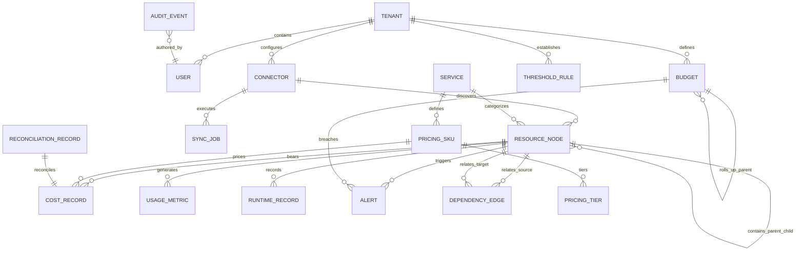
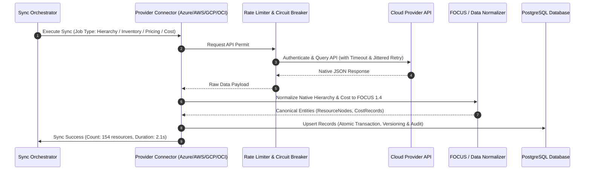

# CloudScope: System Architecture & Technical Design Document

**Document ID:** CS-ARCH-001  
**Version:** 1.0.0  
**Status:** Approved for Implementation  
**Date:** September 2026  

---

## 1. Architectural Philosophy & Principles

1. **Provider Neutrality with Native Fidelity:** Core domain models (nodes, services, metrics, costs) are strictly cloud-agnostic. Provider-specific semantics (Azure ARM IDs, AWS ARNs, GCP URIs, OCI OCIDs) are preserved verbatim in structured metadata attributes.
2. **Deterministic Financial Separation:** Actual billed costs from provider invoicing pipelines are never conflated with calculated estimates or forecasted projections.
3. **Defense-in-Depth & Zero-Trust:** All inputs pass strict schema validation at API boundaries. Secrets are encrypted using AES-256-GCM. No cloud credentials are ever logged or transmitted in plain text.
4. **Resilience & Graceful Degradation:** External cloud API integrations operate with strict timeouts, exponential backoff with jitter, circuit breakers, and idempotency guarantees. Failure of a single cloud sync job will never cascade or block UI operations.
5. **Radical Explainability ("Why does this cost this much?"):** Every financial figure presented to the user is fully traceable back to its underlying pricing SKU, billing unit, usage quantity, and calculation formula.

---

## 2. High-Level Architecture Diagram

```mermaid
flowchart TB
    subgraph UI ["Client Presentation Layer (Next.js / TypeScript / Tailwind)"]
        Dashboard["Executive & Cloud Cockpits"]
        HierarchyView["Native & Canonical Hierarchy Explorer"]
        ServiceInv["Service & Resource Inventory"]
        CostCockpit["Cost & Reconciliation Center"]
        PricingSim["'What-If' Pricing Calculator"]
        DepGraph["Interactive Cost-Aware Dependency Graph"]
        AdminConsole["RBAC, Auditing & Connectors"]
    end

    subgraph API ["Application & API Layer (FastAPI / Pydantic v2)"]
        APIGateway["FastAPI Core (Routing, Auth, Global Error Handler)"]
        AuthMiddleware["JWT / RBAC Security Middleware"]
        CorrelationMW["Correlation-ID & Structured Logging Middleware"]
        
        subgraph Services ["Domain Service Engines"]
            PricingEng["Pricing Intelligence Engine"]
            CostEng["Cost Calculation & Aggregation Engine"]
            ReconEng["Cost Reconciliation Engine"]
            ThreshEng["Threshold & Color State Machine"]
            BudgetEng["Hierarchical Budget Engine"]
            ForecastEng["Run-Rate & Moving Average Forecast Engine"]
            DepEng["Dependency & Topology Engine"]
            AlertEng["Alert Lifecycle Engine"]
            AuditEng["Administrative Audit Engine"]
        end
    end

    subgraph Connectors ["Provider Adapter Framework"]
        BaseConn["Base CloudConnector Interface"]
        AzureAdapter["Azure ARM & Retail Prices Adapter"]
        AWSAdapter["AWS Organizations & Price List Adapter"]
        GCPAdapter["GCP Asset & Billing Catalog Adapter"]
        OCIAdapter["OCI Search & Rate Card Adapter"]
        DemoAdapter["Multi-Cloud Demo / Mock Engine"]
    end

    subgraph Persistence ["Persistence & Caching Layer"]
        Postgres[(PostgreSQL 16 Persistent Store)]
        RedisCache[(Redis / Valkey Task Queue & Cache)]
    end

    UI -->|HTTPS / REST API| APIGateway
    APIGateway --> AuthMiddleware --> CorrelationMW
    CorrelationMW --> Services
    Services --> Connectors
    Services --> Postgres
    Services --> RedisCache
    Connectors -.->|Outbound HTTPS (Real / Mock)| CloudAPIs["Cloud APIs (Azure, AWS, GCP, OCI)"]
```

---

## 3. Canonical Domain Model & Entity-Relationship Schema



### Core Entity Definitions

1. **`Tenant`**: Multi-tenant isolation boundary with organization settings, default currency (`USD`, `EUR`, `GBP`), and retention policies.
2. **`User` & `Role`**: Identity and role-based access control. Predefined enterprise roles: `SUPER_ADMIN`, `PLATFORM_ADMIN`, `CLOUD_ADMIN`, `FINOPS_ADMIN`, `FINANCE_USER`, `IT_OPERATIONS`, `APP_OWNER`, `READ_ONLY`, `AUDITOR`.
3. **`Connector` & `CredentialProfile`**: Provider registration holding connection status, last sync metrics, credentials (encrypted with AES-256-GCM), and configuration scope.
4. **`ResourceNode`**: Canonical hierarchical resource node. Stores `canonical_id`, `provider`, `native_id`, `native_type`, `canonical_role` (`GOVERNANCE_ROOT`, `GOVERNANCE_GROUP`, `BILLING_CONTEXT`, `RESOURCE_CONTAINER`, `RESOURCE`), `parent_id`, `region`, `tags`, and lifecycle timestamps.
5. **`Service` & `PricingSKU`**: Catalog of cloud services and billable SKUs including meter names, units (vCPU-hour, GB-month, requests), pricing tiers, effective date range, and free-tier allowance rules.
6. **`CostRecord`**: Normalized financial record compliant with FOCUS 1.4. Retains `provider`, `billing_account_id`, `resource_id`, `service_id`, `sku_id`, `billed_cost`, `effective_cost`, `currency`, `usage_quantity`, `cost_state` (`ACTUAL`, `ESTIMATED`, `FORECAST`, `MANUAL`), and provider-native raw JSON extensions.
7. **`UsageMetric` & `RuntimeRecord`**: Telemetry and consumption observations (CPU, memory, storage GB, network egress, active hours, schedule profile).
8. **`Budget`**: Hierarchical financial budget with budgeted amount, period (monthly, quarterly, annual), warning and critical thresholds, and roll-up lineage.
9. **`ThresholdRule`**: Declarative metric monitoring rule specifying target measure, threshold bands, color states (`GREEN`, `AMBER`, `ORANGE`, `RED`, `GREY`), and hysteresis buffer.
10. **`DependencyEdge`**: Topology link connecting services (`DEPENDS_ON`, `CONSUMES`, `SHARED_BY`, `HOSTED_ON`, `BILLS_TO`) with confidence scores and cumulative cost attribution.
11. **`Alert`**: Incident record tracked through lifecycle states (`CREATED` → `OPEN` → `ACKNOWLEDGED` → `RESOLVED`).
12. **`ReconciliationRecord`**: Compares estimated cost vs billed actuals with variance dollar amounts, variance percentages, and detected driver classification.
13. **`AuditEvent`**: Immutable security and administrative override trail recording user, timestamp, IP, action, entity, previous state, new state, and rationale.

---

## 4. Provider Connector Architecture & Ingestion Pipeline



---

## 5. Security & Secret Management

- **Master Key Derivation:** App encryption key (`ENCRYPTION_KEY`) using PBKDF2 with SHA-256 and 100,000 iterations.
- **Data At Rest:** Cloud connection secrets (Azure Client Secret, AWS Secret Access Key, GCP Service Account Key, OCI Private Key) are encrypted at rest using AES-256-GCM with unique 96-bit initialization vectors (IVs).
- **Transport Security:** Strict TLS 1.3 for API calls and cloud provider SDK traffic.
- **PII & Secret Redaction:** Structured log filter automatically scans and masks patterns matching private keys, passwords, API tokens, Authorization headers, and credit card numbers.

---

## 6. Observability & Telemetry

- **Structured JSON Logging:** All log output is formatted as JSON conforming to Rule 4.1 (`timestamp`, `level`, `service_name`, `function_name`, `correlation_id`, `message`, `extra_metadata`).
- **Distributed Tracing:** X-Correlation-ID is extracted from inbound requests or generated at the API gateway, then injected into request context and downstream external requests.
- **Prometheus Metrics:**
  - `cloudscope_http_requests_total`: HTTP request volume by method, path, status.
  - `cloudscope_http_request_duration_seconds`: API latency histograms.
  - `cloudscope_sync_duration_seconds`: Provider sync duration and status.
  - `cloudscope_cost_records_ingested_total`: Number of ingested FOCUS records.
  - `cloudscope_active_alerts_count`: Real-time gauge of open alerts by severity.
