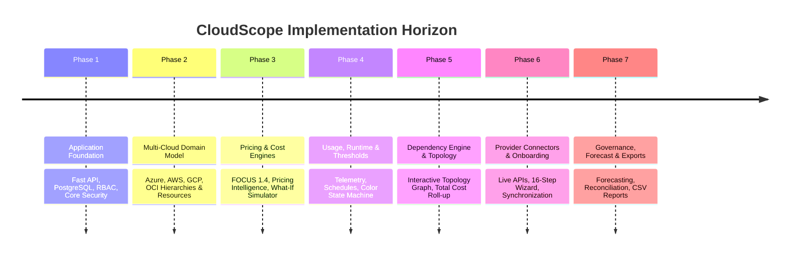

# CloudScope: Implementation Roadmap & Execution Plan

**Document ID:** CS-ROADMAP-001  
**Version:** 1.0.0  
**Target Delivery:** Production-Oriented, Runnable Multi-Cloud Governance Web Application  
**Date:** September 2026  

---

## 1. Roadmap Overview & Phasing

CloudScope is constructed in disciplined, iterative phases ensuring that every functional milestone produces working, verified software backed by automated tests and accessible via an enterprise-grade user interface.

---

## 2. Phase-by-Phase Deliverables & Verification Gates

### Phase 1: Application Foundation & Core Infrastructure
- **Deliverables:**
  - Standardized monorepo structure (`/backend`, `/frontend`, `/infrastructure`, `/docs`, `/scripts`, `/tests`).
  - Production-grade FastAPI backend with structured JSON logging, correlation-ID middleware, global error sanitizer (Rule 2.4), and connection pooling.
  - PostgreSQL database models with SQLAlchemy 2.0 and Alembic migration tracking.
  - JWT authentication, password hashing, and 9-role RBAC enforcement.
  - Modern Next.js / TypeScript / Tailwind CSS frontend foundation with responsive enterprise dashboard layout.
- **Verification Gate:** Passing authentication tests, healthy database connectivity, and clean build (`pnpm build`).

### Phase 2: Multi-Cloud Domain Model & Demo Engine
- **Deliverables:**
  - Canonical `ResourceNode` hierarchy model supporting Azure (Tenant→MG→Sub→RG), AWS (Org→OU→Account), GCP (Org→Folder→Project), and OCI (Tenancy→Compartment).
  - Multi-cloud demo data generator creating realistic cloud estates across all 4 providers.
  - Hierarchy Explorer view with interactive tree drill-down and node inspector.
- **Verification Gate:** Verification script confirming correct node hierarchy and parent-child integrity across 100+ simulated resources.

### Phase 3: Pricing Intelligence & Cost Engine
- **Deliverables:**
  - Pricing Catalog with SKU rate models (hourly, monthly, per-request, storage GB-month, tiered rates).
  - Status evaluator: `FREE`, `FREE_TIER`, `CONDITIONAL_FREE`, `PAID`, `ESTIMATED`, `UNKNOWN`, `NOT_APPLICABLE`.
  - Information icon (ⓘ) popover/modal providing mathematical breakdown: "Why does this service cost this amount?".
  - FOCUS 1.4-aligned `CostRecord` store separating `Actual`, `Estimated`, `Forecast`, and `Manual` figures.
  - Interactive "What Will This Cost?" simulation calculator.
- **Verification Gate:** Unit tests for all pricing statuses and cost aggregation formulas; interactive calculator validation.

### Phase 4: Usage, Runtime Monitoring & Threshold State Machine
- **Deliverables:**
  - Runtime models: 24x7, Scheduled (M-F 8-18), Seasonal, Consumption-based.
  - Time-series usage metrics (CPU, Memory, Storage GB, Network Egress, Requests).
  - Multi-band threshold state machine (`Green` <75%, `Amber` 75-90%, `Orange` 90-100%, `Red` >100%, `Grey` Stale) with hysteresis.
  - Hierarchical budget management with inheritances and utilization alerts.
- **Verification Gate:** Automated threshold transition tests; schedule drift detection verification.

### Phase 5: Topology, Dependency Mapping & Cost Roll-up
- **Deliverables:**
  - Directed service dependency graph with relationship types (`DEPENDS_ON`, `CONNECTS_TO`, `SHARED_BY`, `HOSTED_ON`, `BILLS_TO`).
  - Cost-aware dependency chain calculating: `Direct Cost + Dependent Costs = Total Application Cost`.
  - Interactive SVG/Canvas graph visualization with zoom, pan, and filter controls.
- **Verification Gate:** Cyclic dependency prevention tests; graph cost roll-up accuracy tests.

### Phase 6: Cloud Connectors & 16-Step Onboarding Wizard
- **Deliverables:**
  - Unified `CloudConnector` abstraction interface.
  - Concrete adapters for Azure, AWS, GCP, OCI with rate limiting, jittered retries, and circuit breaker protection.
  - 16-step guided onboarding wizard verifying credentials, discovering hierarchy, selecting scope, and scheduling background sync.
  - Connector status and health dashboard with data freshness tracking.
- **Verification Gate:** Mock and live connector authentication tests; onboarding state progression tests.

### Phase 7: Forecasting, Reconciliation, Reporting & Admin Governance
- **Deliverables:**
  - Explainable run-rate and moving-average cost forecasting with confidence bands.
  - Cost reconciliation engine comparing estimated vs actual provider billing with variance analysis.
  - Alert engine with full lifecycle management (`CREATED` → `OPEN` → `ACKNOWLEDGED` → `RESOLVED`).
  - Comprehensive reporting engine generating streamed CSV and JSON downloads.
  - Admin Console with RBAC user management, credential rotation, and immutable audit logs.
- **Verification Gate:** End-to-end integration test suite; audit logging verification.

---

## 3. The First Vertical Slice Milestone

Per User Request §61, our immediate implementation priority is delivering the complete first vertical slice:

$$\text{Login} \longrightarrow \text{Dashboard} \longrightarrow \text{Cloud Provider} \longrightarrow \text{Hierarchy} \longrightarrow \text{Service} \longrightarrow \text{Pricing} \longrightarrow \text{Cost} \longrightarrow \text{Budget} \longrightarrow \text{Threshold} \longrightarrow \text{Detail}$$

This vertical slice validates the entire application stack—from PostgreSQL persistence to FastAPI routing, service engines, and React frontend—before expanding horizontally.
